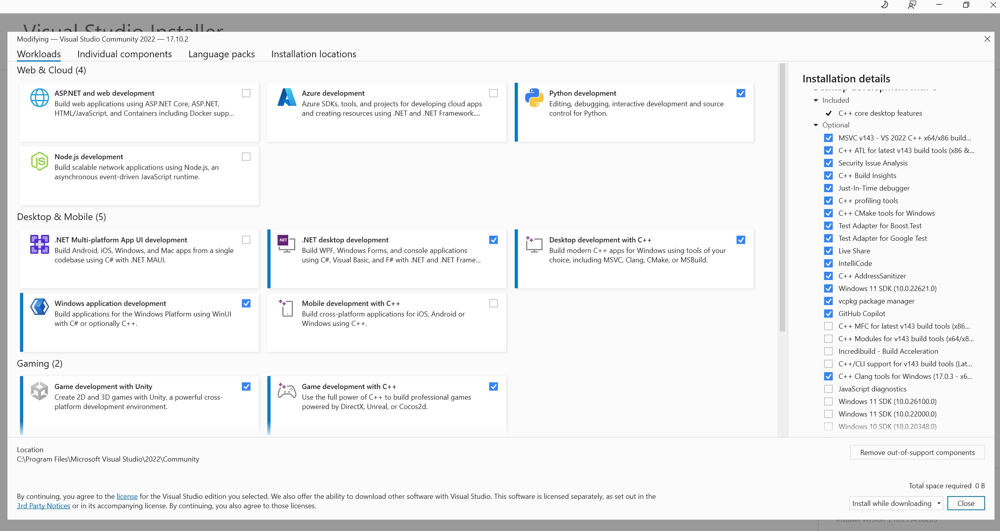
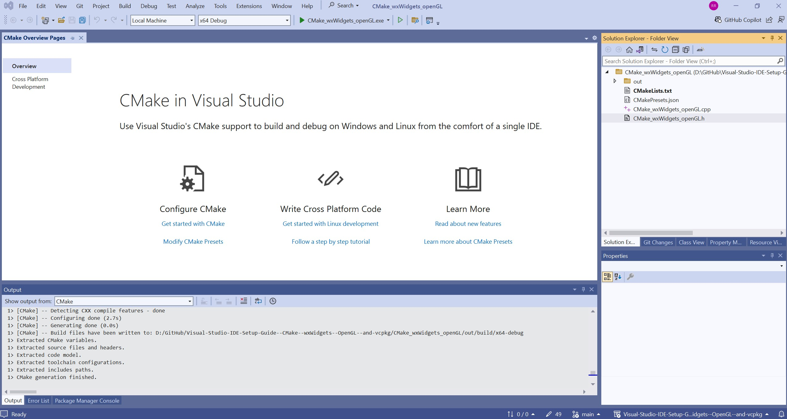
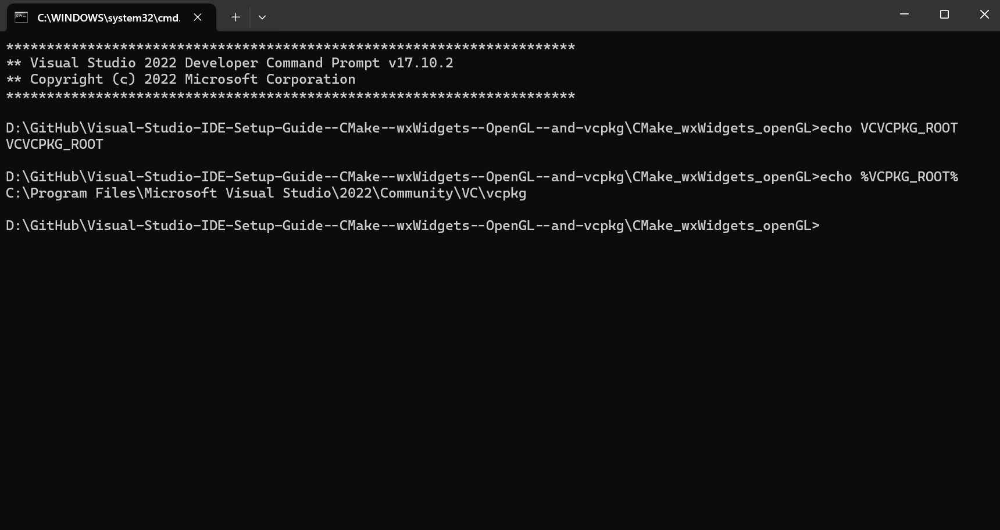
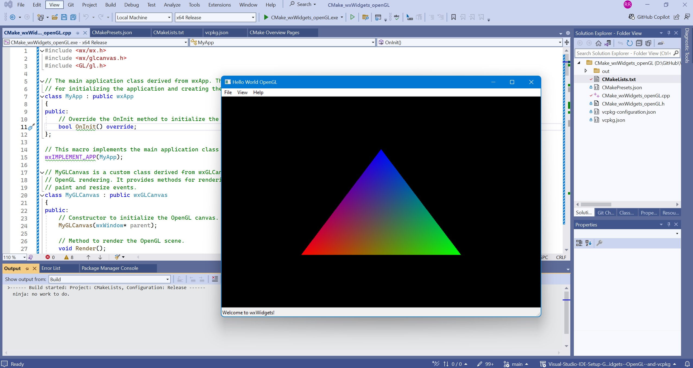

# Visual Studio IDE Setup Guide: CMake, wxWidgets, OpenGL, and vcpkg
 This repository provides instructions on how to set up the Visual Studio IDE for C++ development using CMake, wxWidgets, OpenGL, and the Visual C++ Package Manager (vcpkg).

## Setting up Prerequisites

Before you start, ensure you have the following installed:

###  Download and Install Git

#### Windows

1. Download the Git installer from the [official Git website](https://git-scm.com/downloads).
2. Run the installer and follow the setup instructions. Use the default settings unless you have specific requirements.

#### macOS

1. Install Git using Homebrew. If you don't have Homebrew installed, first install it by running:

   ```bash
   /bin/bash -c "$(curl -fsSL https://raw.githubusercontent.com/Homebrew/install/HEAD/install.sh)"

### Visual Studio, C++ with vcpkg

- Visual Studio 2022 (or later) with the "Desktop development with C++" workload [official website](https://visualstudio.microsoft.com/downloads/).
    In the installation details make sure following are selected,
    - C++ CMake tools for Windows
    - vcpkg package manager (Visual Studio 2022 comes with built-in support for vcpkg, simplifying the process of installing and managing C++ libraries.)

vcpkg is an open-source C++ library manager that helps you manage library dependencies across different platforms. It simplifies the process of finding, installing, and integrating libraries into your C++ projects. Developed by Microsoft, vcpkg is designed to work seamlessly with CMake.



**Note:** Alternatively vcpkg can be cloned directly from the GitHub vcpkg repository using following steps.

1. Clone the repository

    ```bash
    git clone https://github.com/microsoft/vcpkg.git
    ```

2. Run the bootstrap script

    ```bash
    cd vcpkg && bootstrap-vcpkg.bat
    ```

###  Download and Install CMake

CMake is an open-source, cross-platform family of tools designed to build, test, and package software. It controls the software compilation process using simple platform and compiler-independent configuration files, and generates native makefiles and workspaces that can be used in the compiler environment of your choice.

Download the CMake installer from the [official CMake website](https://cmake.org/download/).


## Set Up Visual Studio Project

### Create a New CMake Project

   - Go to `File` > `New` > `Project`.
   - Select `Create a new project`.
   - Select `CMake Project` and click `Next`.
   - Name your project ("CMake_wxWidgets_openGL") and click `Create`.

This will create a project with following project files.

    - CMakeLists.txt
    - CMakePresets.json
    - CMake_wxWidgets_openGL.cpp
    - CMake_wxWidgets_openGL.h



## Configure vcpkg

1. Check vcpkg environment variable

    - Go to `Tools` > `Command Line` > `Developer Command Prompt`.
    - In Command Prompt, type:
    ```bash
    echo %VCPKG_ROOT%
    ```
    - You should get "C:\Program Files\Microsoft Visual Studio\2022\Community\VC\vcpkg" path as response if vcpkg is installed successfully.

**Note:** The `VCPKG_ROOT` environment variable will only be visible in the Visual Studio Environment Command prompt.


**Note:** If you have vcpkg cloned from github use following command to set the environment variable. if Visual Studio vcpkg is already installed it will have `VCPKG_ROOT` environment variable name by default Therefor we need to use a different environment variable name.
    ```bash
    set USER_VCPKG_ROOT="C:\path\to\vcpkg"
    set PATH=%VCPKG_ROOT%;%PATH%
    ```

2. Generate a manifest file and add dependencies

    - In Command Prompt, type the following command to create a vcpkg manifest file (`vcpkg.json`) This will add `vcpkg.json` file and a `vcpkg-configuration.json` file in the project's directory:
    ```bash
    vcpkg new --application
    ```
    - Add the `wxwidgets` `opengl` packages as a dependencies by typing following in the Command Prompt:
    ```bash
    vcpkg add port wxwidgets opengl
    ```
    Now the manifest file `vcpkg.json` should look like this:
    ```bash
    {
    "dependencies": [
        "fmt",
        "opengl",
        "wxwidgets"
        ]
    }
    ```

## Configure CMake files.

1. Configure the `CMakePresets.json` file for letting vcpkg to provide packages to CMake when configuring and building the project:

    - Edit `CMakePresets.json` as follows,
    in the json, under the "cacheVariables", add following line, If you are using the vcpkg that comes with Visual Studio.
    ```bash
    "CMAKE_TOOLCHAIN_FILE": "$env{VCPKG_ROOT}/scripts/buildsystems/vcpkg.cmake"
    ```
    or usimng custom vcpkg Replace `<VCPKG_Path>` with the path to your vcpkg directory
    ```bash
    "CMAKE_TOOLCHAIN_FILE": "<VCPKG_Path>/scripts/buildsystems/vcpkg.cmake"
    ```

    **Note:** A Visual Studio notice will appear to regenerate CMake cache. You need to click this.

    - The edited `CMakePresets.json` file should look lke this:
    ```bash
    {
    "version": 3,
    "configurePresets": [
        {
        "name": "windows-base",
        "hidden": true,
        "generator": "Ninja",
        "binaryDir": "${sourceDir}/out/build/${presetName}",
        "installDir": "${sourceDir}/out/install/${presetName}",
        "cacheVariables": {
            "CMAKE_C_COMPILER": "cl.exe",
            "CMAKE_CXX_COMPILER": "cl.exe",
            "CMAKE_TOOLCHAIN_FILE": "$env{VCPKG_ROOT}/scripts/buildsystems/vcpkg.cmake"
        },
        "condition": {
            "type": "equals",
            "lhs": "${hostSystemName}",
            "rhs": "Windows"
        }
        },
        {
        "name": "x64-debug",
        "displayName": "x64 Debug",
        "inherits": "windows-base",
        "architecture": {
            "value": "x64",
            "strategy": "external"
        },
        "cacheVariables": {
            "CMAKE_BUILD_TYPE": "Debug"
        }
        },
        {
        "name": "x64-release",
        "displayName": "x64 Release",
        "inherits": "x64-debug",
        "cacheVariables": {
            "CMAKE_BUILD_TYPE": "Release"
        }
        },
        {
        "name": "x86-debug",
        "displayName": "x86 Debug",
        "inherits": "windows-base",
        "architecture": {
            "value": "x86",
            "strategy": "external"
        },
        "cacheVariables": {
            "CMAKE_BUILD_TYPE": "Debug"
        }
        },
        {
        "name": "x86-release",
        "displayName": "x86 Release",
        "inherits": "x86-debug",
        "cacheVariables": {
            "CMAKE_BUILD_TYPE": "Release"
        }
        },
        {
        "name": "linux-debug",
        "displayName": "Linux Debug",
        "generator": "Ninja",
        "binaryDir": "${sourceDir}/out/build/${presetName}",
        "installDir": "${sourceDir}/out/install/${presetName}",
        "cacheVariables": {
            "CMAKE_BUILD_TYPE": "Debug",
            "CMAKE_TOOLCHAIN_FILE": "$env{VCPKG_ROOT}/scripts/buildsystems/vcpkg.cmake"
        },
        "condition": {
            "type": "equals",
            "lhs": "${hostSystemName}",
            "rhs": "Linux"
        },
        "vendor": {
            "microsoft.com/VisualStudioRemoteSettings/CMake/1.0": {
            "sourceDir": "$env{HOME}/.vs/$ms{projectDirName}"
            }
        }
        },
        {
        "name": "macos-debug",
        "displayName": "macOS Debug",
        "generator": "Ninja",
        "binaryDir": "${sourceDir}/out/build/${presetName}",
        "installDir": "${sourceDir}/out/install/${presetName}",
        "cacheVariables": {
            "CMAKE_BUILD_TYPE": "Debug",
            "CMAKE_TOOLCHAIN_FILE": "$env{VCPKG_ROOT}/scripts/buildsystems/vcpkg.cmake"
        },
        "condition": {
            "type": "equals",
            "lhs": "${hostSystemName}",
            "rhs": "Darwin"
        },
        "vendor": {
            "microsoft.com/VisualStudioRemoteSettings/CMake/1.0": {
            "sourceDir": "$env{HOME}/.vs/$ms{projectDirName}"
            }
        }
        }
    ]
    }
    ```

2. Configure the ` CMakeLists.txt` fto link the libraries to the C++ project files:

    - Revise the contents of the `CMakeLists.txt` file as follows:
    ```bash

    # CMakeList.txt : CMake project for CMake_wxWidgets_openGL

    cmake_minimum_required (VERSION 3.8)

    # Enable Hot Reload for MSVC compilers if supported.
    if (POLICY CMP0141)
    cmake_policy(SET CMP0141 NEW)
    set(CMAKE_MSVC_DEBUG_INFORMATION_FORMAT "$<IF:$<AND:$<C_COMPILER_ID:MSVC>,$<CXX_COMPILER_ID:MSVC>>,$<$<CONFIG:Debug,RelWithDebInfo>:EditAndContinue>,$<$<CONFIG:Debug,RelWithDebInfo>:ProgramDatabase>>")
    endif()

    project ("CMake_wxWidgets_openGL")

    # Set C++ standard
    set(CMAKE_CXX_STANDARD 17)
    set(CMAKE_CXX_STANDARD_REQUIRED ON)

    # Find wxWidgets
    find_package(wxWidgets REQUIRED COMPONENTS core base gl)

    # Include wxWidgets macros and definitions
    include(${wxWidgets_USE_FILE})

    # Add the executable target with WIN32 option for a GUI application
    add_executable(CMake_wxWidgets_openGL WIN32 CMake_wxWidgets_openGL.cpp)

    # Ensure the correct subsystem is used
    set_target_properties(CMake_wxWidgets_openGL PROPERTIES
        WIN32_EXECUTABLE YES
    )

    if (CMAKE_VERSION VERSION_GREATER 3.12)
    set_property(TARGET CMake_wxWidgets_openGL PROPERTY CXX_STANDARD 20)
    endif()

    # Link wxWidgets libraries
    target_link_libraries(CMake_wxWidgets_openGL ${wxWidgets_LIBRARIES} ${OPENGL_gl_LIBRARY})

    ```

**Note:** After saving the newly edited ` CMakeLists.txt` file. Visual Studio will automatically start applying CMake changes. When everything is done  you would see `CMake generation finished.` message at the end of the Output window.


## Run the example C++ code.

    - Replace the contents of the `CMake_wxWidgets_openGL.cpp` file with the following code:
    ```bash

    #include <wx/wx.h>
    #include <wx/glcanvas.h>
    #include <GL/gl.h>

    // The main application class derived from wxApp. This class is responsible
    // for initializing the application and creating the main frame.
    class MyApp : public wxApp
    {
    public:
        // Override the OnInit method to initialize the main frame.
        bool OnInit() override;
    };

    // This macro implements the main application class and starts the application.
    wxIMPLEMENT_APP(MyApp);

    // MyGLCanvas is a custom class derived from wxGLCanvas that handles
    // OpenGL rendering. It provides methods for rendering and handling
    // paint and resize events.
    class MyGLCanvas : public wxGLCanvas
    {
    public:
        // Constructor to initialize the OpenGL canvas.
        MyGLCanvas(wxWindow* parent);

        // Method to render the OpenGL scene.
        void Render();

    private:
        // Event handler for paint events.
        void OnPaint(wxPaintEvent& event);

        // Event handler for resize events.
        void OnResize(wxSizeEvent& event);

        // OpenGL context needed for rendering.
        wxGLContext* m_context;

        // Declare the event table to map events to their handlers.
        wxDECLARE_EVENT_TABLE();
    };

    // Define the event table for MyGLCanvas to handle paint and resize events.
    wxBEGIN_EVENT_TABLE(MyGLCanvas, wxGLCanvas)
    EVT_PAINT(MyGLCanvas::OnPaint)
    EVT_SIZE(MyGLCanvas::OnResize)
    wxEND_EVENT_TABLE()

    // MyFrame is the main application window class derived from wxFrame.
    // It creates and manages the menu, status bar, and the OpenGL canvas.
    class MyFrame : public wxFrame
    {
    public:
        // Constructor to initialize the main frame.
        MyFrame();

    private:
        // Event handler for the "Hello" menu item.
        void OnHello(wxCommandEvent& event);

        // Event handler for the "Exit" menu item.
        void OnExit(wxCommandEvent& event);

        // Event handler for the "About" menu item.
        void OnAbout(wxCommandEvent& event);

        // Event handler for the "OpenGL" menu item.
        void OnOpenGL(wxCommandEvent& event);

        // OpenGL canvas object.
        MyGLCanvas* m_glCanvas;

        // Declare the event table to map events to their handlers.
        wxDECLARE_EVENT_TABLE();
    };

    // Enum for menu item IDs.
    enum
    {
        ID_Hello = 1,
        ID_OpenGL = 2 // ID for OpenGL menu item.
    };

    // Define the event table for MyFrame to handle menu events.
    wxBEGIN_EVENT_TABLE(MyFrame, wxFrame)
    EVT_MENU(ID_Hello, MyFrame::OnHello)
    EVT_MENU(wxID_EXIT, MyFrame::OnExit)
    EVT_MENU(wxID_ABOUT, MyFrame::OnAbout)
    EVT_MENU(ID_OpenGL, MyFrame::OnOpenGL) // Bind the OpenGL menu item to its handler.
    wxEND_EVENT_TABLE()

    // Implementation of the OnInit method to initialize the main frame.
    // This method is called when the application starts.
    bool MyApp::OnInit()
    {
        MyFrame* frame = new MyFrame();
        frame->Show(true);
        return true;
    }

    // Constructor for MyFrame to create the main application window.
    MyFrame::MyFrame()
        : wxFrame(nullptr, wxID_ANY, "Hello World OpenGL", wxDefaultPosition, wxSize(800, 600))
    {
        // Create the "File" menu.
        wxMenu* menuFile = new wxMenu;
        menuFile->Append(ID_Hello, "&Hello...\tCtrl-H", "Help string shown in status bar for this menu item");
        menuFile->AppendSeparator();
        menuFile->Append(wxID_EXIT);

        // Create the "View" menu and add the OpenGL item.
        wxMenu* menuView = new wxMenu;
        menuView->Append(ID_OpenGL, "&OpenGL", "OpenGL view");

        // Create the "Help" menu.
        wxMenu* menuHelp = new wxMenu;
        menuHelp->Append(wxID_ABOUT);

        // Create the menu bar and append the menus.
        wxMenuBar* menuBar = new wxMenuBar;
        menuBar->Append(menuFile, "&File");
        menuBar->Append(menuView, "&View");
        menuBar->Append(menuHelp, "&Help");

        // Set the menu bar for the frame.
        SetMenuBar(menuBar);

        // Create the status bar to display messages.
        CreateStatusBar();
        SetStatusText("Welcome to wxWidgets!");

        // Create the OpenGL canvas but don't show it initially.
        m_glCanvas = new MyGLCanvas(this);
        m_glCanvas->Hide();
    }

    // Event handler for the "Exit" menu item. This closes the application.
    void MyFrame::OnExit(wxCommandEvent& event)
    {
        Close(true);
    }

    // Event handler for the "About" menu item. This shows an About dialog.
    void MyFrame::OnAbout(wxCommandEvent& event)
    {
        wxMessageBox("This is a wxWidgets Hello World example", "About Hello World", wxOK | wxICON_INFORMATION);
    }

    // Event handler for the "Hello" menu item. This logs a message.
    void MyFrame::OnHello(wxCommandEvent& event)
    {
        wxLogMessage("Hello world from wxWidgets!");
    }

    // Event handler for the "OpenGL" menu item. This shows the OpenGL canvas.
    void MyFrame::OnOpenGL(wxCommandEvent& event)
    {
        m_glCanvas->Show(true);
        Layout(); // Update the layout to accommodate the shown canvas.
    }

    // Implementation of the MyGLCanvas constructor to initialize the OpenGL canvas.
    // This constructor creates the OpenGL context.
    MyGLCanvas::MyGLCanvas(wxWindow* parent)
        : wxGLCanvas(parent, wxID_ANY, nullptr)
    {
        m_context = new wxGLContext(this);
        SetBackgroundStyle(wxBG_STYLE_PAINT);
    }

    // Method to render the OpenGL scene. This method is called to draw the scene.
    void MyGLCanvas::Render()
    {
        SetCurrent(*m_context);
        wxPaintDC(this);

        // Clear the screen with a black background.
        glClearColor(0.0, 0.0, 0.0, 1.0);
        glClear(GL_COLOR_BUFFER_BIT);

        // Draw a simple colored triangle.
        glBegin(GL_TRIANGLES);
        glColor3f(1.0, 0.0, 0.0);
        glVertex2f(-0.5f, -0.5f);
        glColor3f(0.0, 1.0, 0.0);
        glVertex2f(0.5f, -0.5f);
        glColor3f(0.0, 0.0, 1.0);
        glVertex2f(0.0f, 0.5f);
        glEnd();

        glFlush();
        SwapBuffers();
    }

    // Event handler for paint events. This method is called when the canvas needs
    // to be repainted.
    void MyGLCanvas::OnPaint(wxPaintEvent& event)
    {
        Render();
    }

    // Event handler for resize events. This method is called when the canvas is
    // resized. It adjusts the OpenGL viewport to match the new size.
    void MyGLCanvas::OnResize(wxSizeEvent& event)
    {
        int width, height;
        GetClientSize(&width, &height);
        if (height == 0)
            height = 1;
        glViewport(0, 0, width, height);

        Refresh(); // Trigger a paint event to redraw the scene.
    }

    ```

## Build and Run.

1. Build
    - Select th type of build ex `x64-debug` or "x64-release".
    - Go to `Build` > `Rebuild All`.

2. Run
    - Go to `DeBug` > `Start Without Debugging`.
    This will run the program ans show it's main application window.
    In the window,
    - Go to `View` > `OpenGL`. to show Graphics Window withing main application window.




